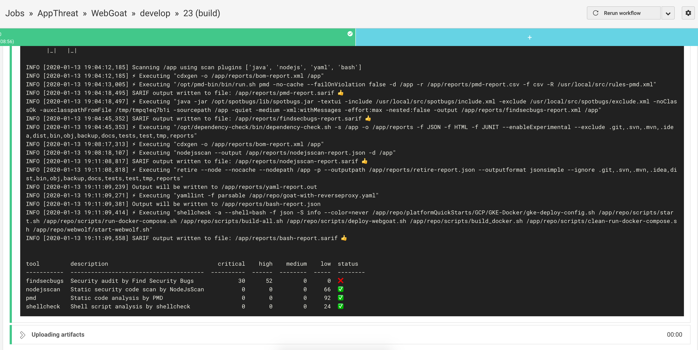
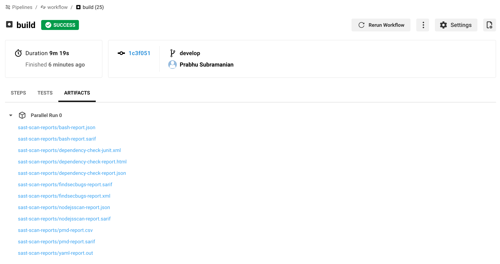

# Integration with CircleCI

sast-scan has decent integration with CircleCI. This repo contains an [example for a yaml pipeline](https://github.com/ShiftLeftSecurity/WebGoat/blob/develop/.circleci/config.yml) that invokes sast-scan using docker run.

Note:

- CircleCI does not support docker volume mounts. A suggested [workaround](https://circleci.com/docs/2.0/building-docker-images/#mounting-folders) is to use `docker create` along with `docker cp` to copy the repo with compiled code and then perform sast-scan against that.

## Usage

The config is reproduced here for convenience.

```yaml
steps:
  - checkout
  - setup_remote_docker
  - run:
      name: Compile and prepare volume
      command: |
        # Compile the code
        mvn compile
        # Create a dummy container with the application data
        docker create -v /app --name appcon alpine:3.4 /bin/true
        # Copy the repo to the temporary volume
        docker cp $PWD appcon:/app
  - run:
      name: Perform sast-scan
      command: |
        set +e
        # start an application container using this volume
        docker run --name sastscan -e "WORKSPACE=${CIRCLE_REPOSITORY_URL}" --volumes-from appcon shiftleft/sast-scan scan --src /app --out_dir /app/reports
        # Copy the reports
        docker cp sastscan:/app/reports reports
  - store_artifacts:
      path: reports
      destination: sast-scan-reports
```

In the above snippet, almost all the steps are necessary.

- setup_remote_docker - This is required for performing docker create, cp commands etc
- mvn compile - Certain tools expect both the source code and its compiled form. Hence it is necessary to compile and build the application before performing sast-scan
- `docker create and cp` - This is the workaround for the lack of volume mounts in CircleCI. If you are not a fan of this, then ask CircleCI to implement the mount feature 😒
- `set +e` - This prevents the docker run command from breaking the build so that the reports can be stored and viewed later on. Alternatively, if you indeed want the build to break then remove this line.
- `docker cp` - This is how the produced reports are copied back to the build container
- `store_artifacts` - Stores reports as an artifact for later use

## Screenshots




